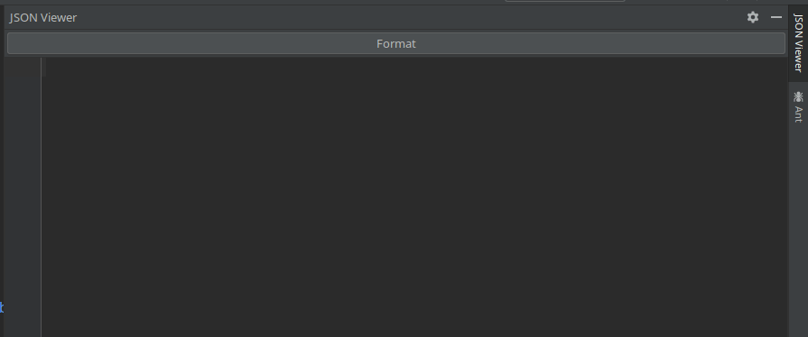

# Json Viewer
Intellij plugin to format json to a human readable way.
* Format with `Alt+F` or click "Format"
* Search in json with your search key (e.g. `Cltr+F`)

## Getting Started

Download the plugin via the JetBrains products directly
from their [marketplace](https://plugins.jetbrains.com/plugin/14149-json-viewer)!

## Screencast

